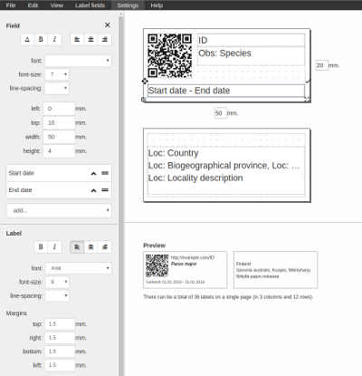

# Label Designer

This Angular library enables users to design their own printable labels.
Visuals and the fields for the label can be defined by the users.
This was developed specimen data in mind, but this can be used for other kinds of labels also.

## Getting started
There are few ways you can use this library.
1. [Angular library](https://luomus.github.io/label-designer/additional-documentation/usage/angular-component.html)
2. [Custom element](https://luomus.github.io/label-designer/additional-documentation/usage/custom-html-element.html)
3. [Standalone application](https://luomus.github.io/label-designer/additional-documentation/usage/standalone-app.html)

# Documentation

Read the online documentation [here](https://luomus.github.io/label-designer).

## Contributing
Development is a community effort, and we encourage participation. Please read the [contribution guide](additional-documentation/contributing.html) for details.

Please note that the 'label-designer' project is released with a [Contributor Code of Conduct](additional-documentation/contributor-code-of-conduct.html). By contributing to this project, you agree to abide by its terms.
